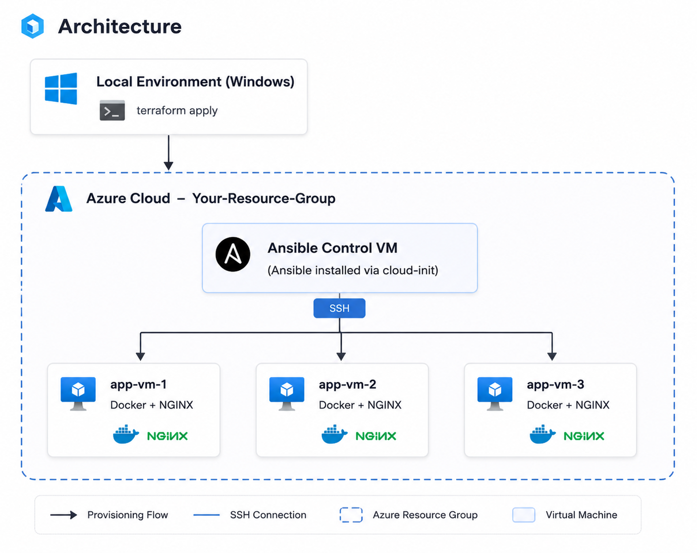
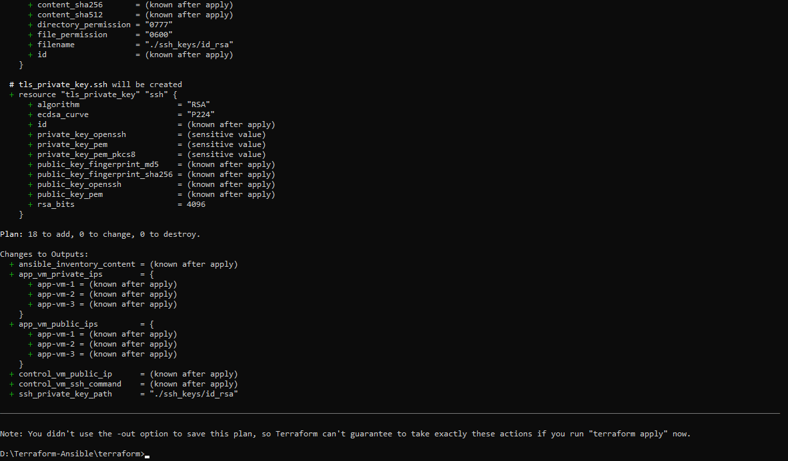
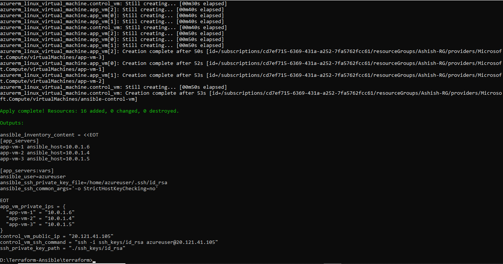
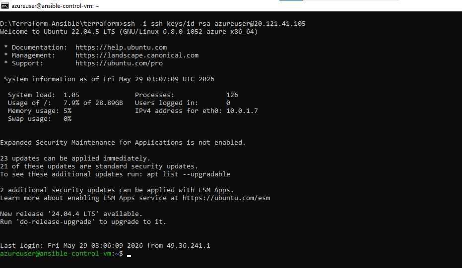
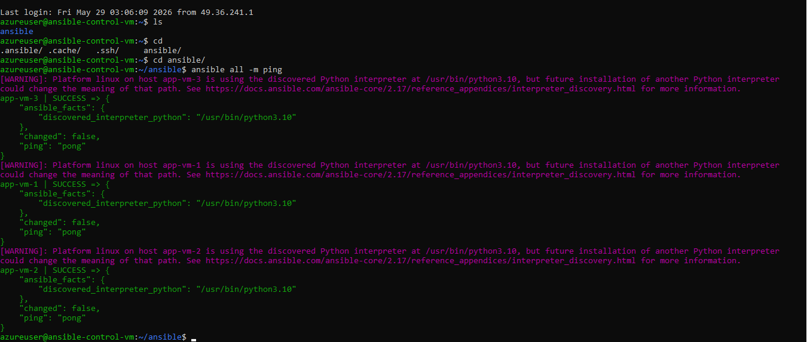
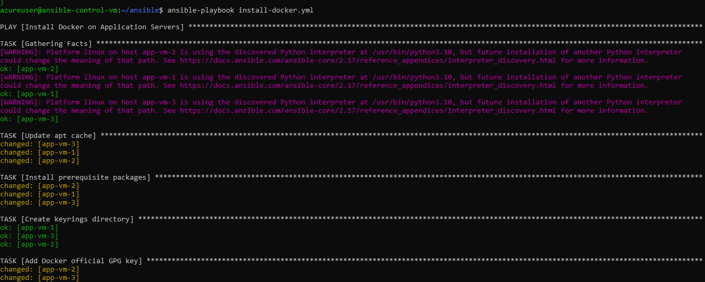
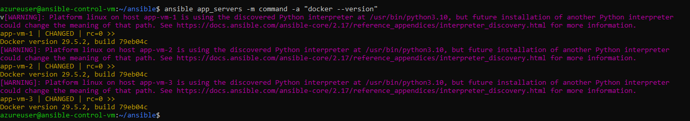
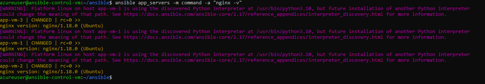

<div align="center">

<h1>
   
  Azure Infrastructure Automation
</h1>

<p align="center">
  <kbd>DOCKER</kbd> | <kbd>UBUNTU 22.04</kbd> | <kbd>NGINX</kbd> | <kbd>SSH</kbd> | <kbd>CLOUD-INIT</kbd>
</p>

<p align="center">
  
  
  
</p>

<h3>DevOps Portfolio Project — Provisioning and Configuration Management on Azure</h3>

</div>

---

## Project Overview

This project provisions Azure infrastructure using **Terraform** (from a local Windows environment) and configures application VMs using **Ansible** (from a dedicated Azure control VM). It demonstrates:

- Infrastructure as Code (IaC) with Terraform
- Centralized configuration management with Ansible
- SSH-based automation workflows
- Cloud-init bootstrapping

---

## Architecture



---


## Project Structure

```text
terraform-ansible-lab/
├── terraform/
│   ├── provider.tf          # Azure provider configuration
│   ├── variables.tf         # Variable definitions
│   ├── main.tf              # Core infrastructure resources
│   └── outputs.tf           # Output values (IPs, SSH commands)
│
├── ansible/
│   ├── ansible.cfg          # Ansible configuration
│   ├── inventory.ini        # Static inventory (update after apply)
│   ├── install-docker.yml   # Playbook: Install Docker
│   └── install-nginx.yml    # Playbook: Install NGINX + web page
│
└── README.md
```

---

## Execution Walkthrough

### Step 1: Provision Infrastructure with Terraform

The infrastructure is provisioned using Terraform, which sets up the networking, security groups, control VM, and application VMs.

<details>
<summary>View Terraform Plan</summary>


*Reviewing the execution plan before deployment.*
</details>

<details>
<summary>View Terraform Apply</summary>


*Successfully applying the Terraform configuration.*
</details>

### Step 2: Transfer Files and Access the Control VM

Once the infrastructure is up, transfer your Ansible configuration files and the generated SSH key to the Control VM, then securely SSH into it.

```bash
# Transfer Ansible playbook files to the Control VM
scp -o StrictHostKeyChecking=no -i terraform/ssh_keys/id_rsa -r ansible/* azureuser@<control-vm-public-ip>:~/ansible/

# Transfer the generated SSH private key for internal VM access
scp -o StrictHostKeyChecking=no -i terraform/ssh_keys/id_rsa terraform/ssh_keys/id_rsa azureuser@<control-vm-public-ip>:~/.ssh/id_rsa

# SSH into the Control VM
ssh -o StrictHostKeyChecking=no -i terraform/ssh_keys/id_rsa azureuser@<control-vm-public-ip>
```

<details>
<summary>View Control VM SSH</summary>


*Connecting to the Ansible Control VM.*
</details>

### Step 3: Verify Connectivity

Before running playbooks, test the SSH connectivity from the Control VM to all Application VMs.

<details>
<summary>View Ping Test</summary>


*Successfully pinging the application nodes using Ansible.*
</details>

### Step 4: Run Ansible Playbooks

Execute the playbooks to install Docker and NGINX on the target nodes.

<details>
<summary>View Docker Installation Playbook</summary>


*Executing the Docker installation playbook.*
</details>

### Step 5: Verify Installation

Ensure that Docker and NGINX are successfully running on the application nodes.

<details>
<summary>View Docker Verification</summary>


*Verifying Docker installation.*
</details>

<details>
<summary>View NGINX Verification</summary>


*Verifying NGINX installation.*
</details>

---

## Infrastructure Components

| Resource | Name | Details |
|----------|------|---------|
| Resource Group | Your-Resource-Group | Created by Terraform |
| Virtual Network | terraform-ansible-vnet | 10.0.0.0/16 |
| Subnet | default-subnet | 10.0.1.0/24 |
| NSG | terraform-ansible-nsg | Allow SSH (22), HTTP (80) |
| Control VM | ansible-control-vm | Standard_D2s_v3, Ubuntu 22.04 |
| App VM 1 | app-vm-1 | Standard_D2s_v3, Ubuntu 22.04 |
| App VM 2 | app-vm-2 | Standard_D2s_v3, Ubuntu 22.04 |
| App VM 3 | app-vm-3 | Standard_D2s_v3, Ubuntu 22.04 |

---

## Technology Stack

| Technology | Purpose | Location |
|------------|---------|----------|
| Terraform  | Infrastructure provisioning | Local Environment |
| Azure CLI  | Azure authentication | Local Environment |
| Git        | Version control | Local Environment |
| Ansible    | Configuration management | Azure Control VM |
| Ubuntu 22.04 | Operating system | All Azure VMs |
| Docker     | Container runtime | App VMs |
| NGINX      | Web server | App VMs |

---

<br>
<br>

> *Implemented Azure infrastructure automation using Terraform and Ansible. Provisioned and managed multiple Ubuntu virtual machines, automated configuration management through centralized orchestration, and deployed Docker and NGINX across multiple servers using SSH-based automation workflows.*
